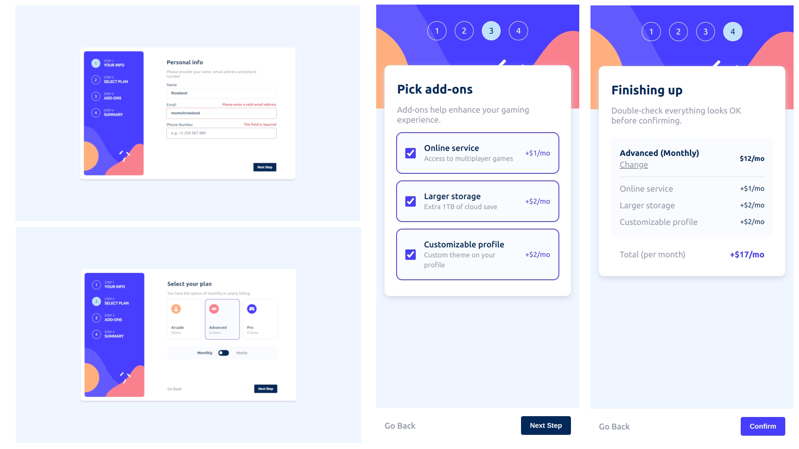

# Frontend Mentor - Multi-step form solution

This is a solution to the [Multi-step form challenge on Frontend Mentor](https://www.frontendmentor.io/challenges/multistep-form-YVAnSdqQBJ). Frontend Mentor challenges help you improve your coding skills by building realistic projects. 

## Table of contents

- [Overview](#overview)
  - [The challenge](#the-challenge)
  - [Screenshot](#screenshot)
  - [Links](#links)
- [My process](#my-process)
  - [Built with](#built-with)
  - [What I learned](#what-i-learned)
  - [Continued development](#continued-development)
  - [Useful resources](#useful-resources)
- [Author](#author)
- [Acknowledgments](#acknowledgments)

**Note: Delete this note and update the table of contents based on what sections you keep.**

## Overview

### The challenge

Users should be able to:

- Complete each step of the sequence
- Go back to a previous step to update their selections
- See a summary of their selections on the final step and confirm their order
- View the optimal layout for the interface depending on their device's screen size
- See hover and focus states for all interactive elements on the page
- Receive form validation messages if:
  - A field has been missed
  - The email address is not formatted correctly
  - A step is submitted, but no selection has been made

### Screenshot

### Links

- Solution URL: [Click here](https://www.frontendmentor.io/solutions/multi-step-form-knnr6mBgU0)
- Live Site URL: [Click here](https://fe-multistep-form.netlify.app/)

## My process

### Built with

- Semantic HTML5 markup
- Flexbox
- CSS Grid
- SCSS
- Mobile-first workflow
- TypeScript
- [React](https://reactjs.org/) - JS library

### What I learned

I learnt how to properly use useState hook to store the form states so it can persist across renders

I also learnt how to use the @use method of importing SCSS modules.

I further strenghtened my understanding of react and how to properly structure my project folders

### Continued development

I want to continue practicing to improve my skills in React and also learn NextJS to build robust and full-stack applications.

### Useful resources

- [React useStateHook Typescript](https://codedamn.com/news/reactjs/usestate-hook-typescript) - This is an amazing article which helped me finally understand how useState hooks work in react and how to set types in the useState using generic types in typescript.

## Author

- Website - [Rowland Momoh](https://rowland-momoh.netlify.app/://www.your-site.com)
- Frontend Mentor - [@rowleks](https://www.frontendmentor.io/profile/rowleks)
- Twitter - [@Rolexks](https://x.com/Rolexks)

## Acknowledgments

I'm grateful to frontend mentor for this challenge as it helps build my web development skills further. I also thank google, w3school, MDN web docs, codedamn and other similar sites for their amazing and helpful resources.
